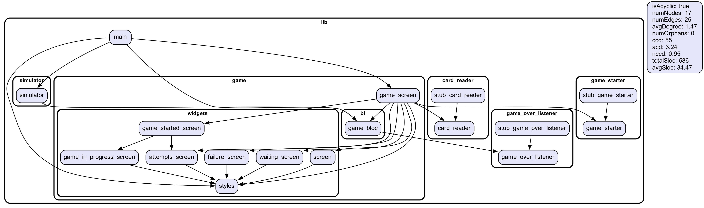
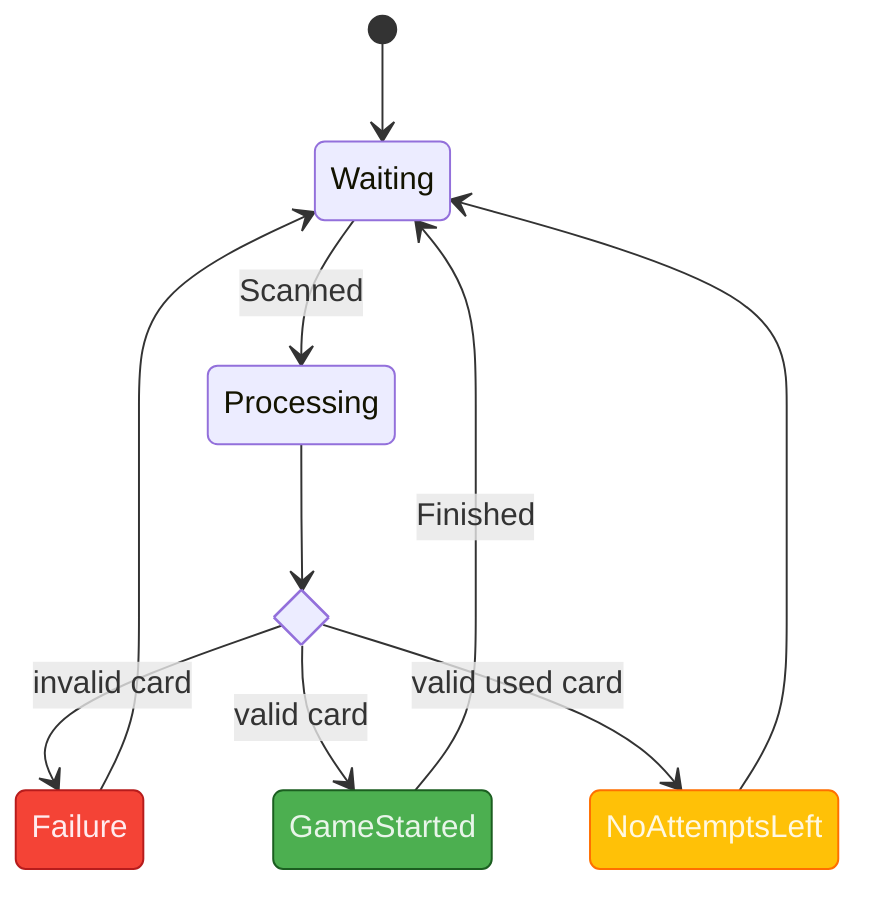

# claw_machine

- [The story of the claw machine](https://developers.mews.com/event-booth-story/)

Claw machine controller for Raspberry Pi.

## Dependencies Graph

## GameBloc State Machine

```mermaid
stateDiagram-v2
    Waiting
    Processing
    GameStarted
    NoAttemptsLeft
    Failure
    state card_processing <<choice>>

    classDef failure fill:#F44336,stroke:#B71C1C,color:#FFEBEE
    classDef success fill:#4CAF50,stroke:#1B5E20,color:#E8F5E9
    classDef warning fill:#FFC107,stroke:#FF6F00,color:#FFF8E1

    class Failure failure
    class GameStarted success
    class NoAttemptsLeft warning

    [*] --> Waiting
    Waiting --> Processing: Scanned
    Processing --> card_processing
    card_processing --> Failure: invalid card
    card_processing --> GameStarted: valid card
    card_processing --> NoAttemptsLeft: valid used card
    GameStarted --> Waiting: Finished
    Failure --> Waiting
    NoAttemptsLeft --> Waiting
```
